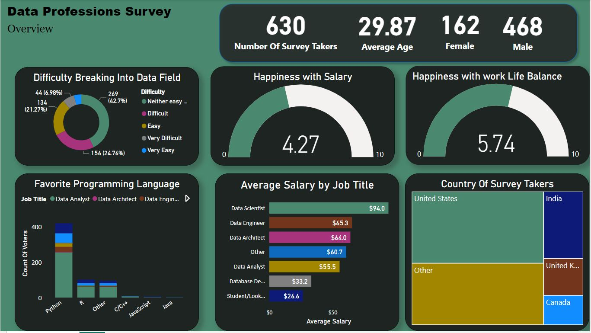

# Data-Professional-Survey

---

## Introduction
This is a power Bi project on data professional survey. The project is to provides crucial insights for individuals in the data industry and those interested in pursuing a career in data. 

## Project Task
1. Evaluate the difficulty of entering the tech industry: Assess the perception of professionals regarding the ease or difficulty of breaking into the tech field and analyze the factors contributing to this perception. Identify potential barriers and develop strategies to facilitate entry into the industry.
2. Assess the popularity and utilization of programming languages: Analyze the preferences and usage patterns of data professionals towards programming languages, particularly Python, R, and C++. Understand the demand for specific languages in different data roles and identify opportunities to provide training and resources to meet these needs.
3. Analyze salary trends and satisfaction levels: Examine the average salaries across different data roles and assess professionals’ satisfaction with their compensation. Identify areas where salary levels may be a concern, such as for students and entry-level professionals, and develop strategies to bridge the salary gap and enhance overall satisfaction.
4. Evaluate work-life balance satisfaction: Analyze professionals’ ratings of work-life balance and identify areas for improvement. Assess factors that contribute to work-life balance, such as flexible work arrangements and a healthy work environment. Develop initiatives to enhance work-life balance and promote employee well-being.
5. Provide recommendations for industry improvement: Based on the survey findings, develop recommendations for organizations and professionals in the data field. Propose initiatives such as mentorship programs, accessible resources for tech industry entry, training opportunities for programming languages, competitive compensation packages, career growth support, and initiatives to enhance work-life balance.

   ## Skills/ concepts demonstrated:

   The following Power Bi features were incorporated:
   - DAX
   - Quick measures
   - Split column
   - Modelling
  
     You can interact with the report 
     
     

     ##Data Professional Survey Findings

   The survey gathered responses from a total of 630 participants, with an average age of 29 years.
Regarding the perceived difficulty of breaking into the tech industry, 42.7% of the professionals interviewed stated that it was neither difficult nor easy. On the other hand, 24.8% rated it as difficult to enter the tech field.

When it comes to programming languages, the top three most commonly used and favored languages were Python, R, and C++. Python was the preferred choice for over 200 Data Analysts, followed by 29 Data Engineers, 20 Data Scientists, 56 students, and 54 professionals from other fields. In total, 414 professionals selected Python as their favorite programming language.

In terms of salary, the highest-earning professionals in the data field were Data Scientists, earning an average of $94,000 per year. They were followed by Data Engineers with an average annual salary of $65,000, and Data Architects with an average of $64,000 per year. Students and Database Developers were the lowest earners, with average annual salaries of $27,000 and $33,000, respectively.

Participants expressed a moderate level of satisfaction with their salary, rating it at an average of 4.27 out of 10. However, when it comes to work-life balance, the average rating was higher at 5.74 out of 10.

##Recommendations and Conclusion:

Based on the survey findings, several recommendations can be made:
1. Tech Industry Entry: Despite the perception of difficulty, a significant portion of professionals believe that breaking into the tech industry is neither easy nor difficult. To facilitate entry into the field, providing more accessible resources, mentorship programs, and networking opportunities could be beneficial.
2. Programming Languages: Python is widely favored among data professionals, indicating its importance in the field. Organizations should invest in training and resources for Python to meet the demand of data analysts, engineers, scientists, and other professionals. Additionally, promoting the benefits and applications of other popular languages like R and C++ can help professionals broaden their skill sets.
3. Salary and Career Growth: Data Scientists remain the highest earners in the data field. To attract and retain top talent, organizations should offer competitive compensation packages and provide opportunities for career growth and development. Additionally, supporting students and entry-level professionals with internships, scholarships, and mentorship programs can help bridge the salary gap and encourage their career advancement.
4. Work-Life Balance: While professionals expressed a moderate level of satisfaction with their work-life balance, there is room for improvement. Employers should prioritize employee well-being, promote flexible work arrangements, and foster a healthy work environment to enhance overall satisfaction and productivity.
   
In conclusion, the survey results provide valuable insights into the data field, highlighting the importance of Python as a preferred programming language, the earning potential of various data roles, and the significance of work-life balance. Organizations and professionals can utilize these findings to make informed decisions and drive positive changes in the industry.
     
